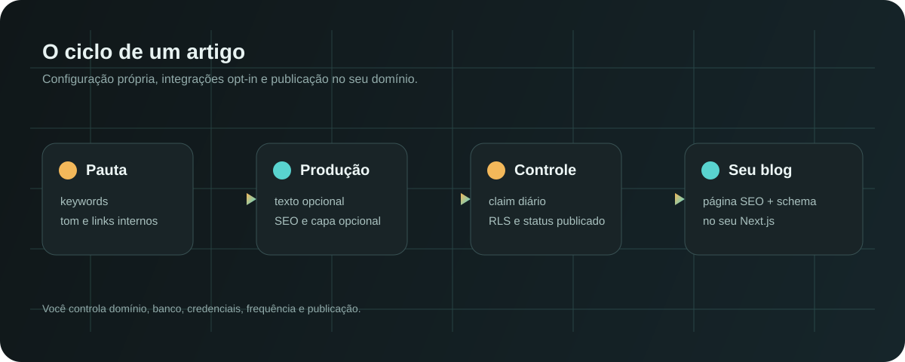
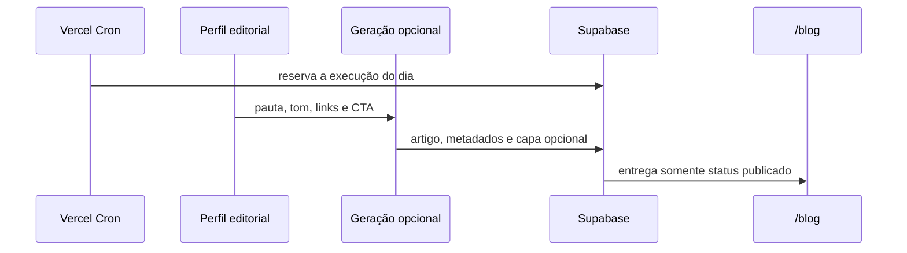
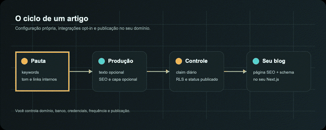

<p align="center">
  
</p>

<h1 align="center">Auto-blog Template</h1>

<p align="center">
  Infraestrutura open source para transformar pauta em artigo publicado no seu domínio.
</p>

<p align="center">
  <a href="https://github.com/luisroquette/autoblog-template/actions/workflows/ci.yml"></a>
  <a href="https://github.com/luisroquette/RocketLabs"></a>
  <a href="https://github.com/luisroquette/autoblog-template/releases/latest"></a>
  <a href="./LICENSE"></a>
  <a href="https://nextjs.org/"></a>
  <a href="https://supabase.com/"></a>
</p>

<p align="center">
  <a href="#comece-em-10-minutos">Começar</a>
  · <a href="#o-ciclo-de-um-artigo">Como funciona</a>
  · <a href="#o-que-vem-no-repositório">Arquitetura</a>
  · <a href="./SETUP.md">Setup completo</a>
  · <a href="./SECURITY.md">Segurança</a>
</p>

---

Um blog exige mais do que um editor de texto. Tem pauta, contexto da empresa,
links internos, banco, SEO, publicação e uma rotina que não pode disparar duas
vezes no mesmo dia.

O Auto-blog reúne essa parte em um repositório que você controla. A empresa
aparece em um único perfil; o pipeline roda no seu Next.js e grava no seu
Supabase. As contas de IA, Search Console e Vercel continuam sendo suas.

## Sumário

- [O ciclo de um artigo](#o-ciclo-de-um-artigo)
- [Demonstração do fluxo](#demonstração-do-fluxo)
- [O que você controla](#o-que-você-controla)
- [Faça uma instalação limpa](#faça-uma-instalação-limpa)
- [O que vem no repositório](#o-que-vem-no-repositório)
- [Integrações e custos](#integrações-e-custos)
- [Segurança operacional](#segurança-operacional)
- [Onde ele encaixa](#onde-ele-encaixa)
- [Limites honestos](#limites-honestos)
- [Contribuir](#contribuir)

## O ciclo de um artigo

<p align="center">
  
</p>



O cron só avança após reservar a execução do dia. Isso evita duas publicações
quando uma chamada manual e o agendamento chegam juntas. Se uma execução ficar
presa, ela pode ser recuperada. O acesso público lê apenas conteúdo publicado.

### Demonstração do fluxo

<p align="center">
  
</p>

<p align="center"><sub>Fluxo conceitual baseado nos componentes reais deste repositório.</sub></p>

## O que você controla

Tudo que precisa ter a cara da empresa está concentrado em
[`src/lib/autoblog-profile.ts`](./src/lib/autoblog-profile.ts):

```ts
export const AUTOBLOG_PROFILE = {
  brand: { name: 'Sua Empresa', siteUrl: 'https://seudominio.com.br' },
  editorial: {
    audience: 'quem você quer alcançar',
    tone: 'como a empresa fala',
    seedKeywords: ['assunto 1', 'assunto 2'],
    internalLinks: [],
  },
  cta: { buttonLabel: 'Falar com a equipe', url: 'https://...' },
  integrations: {
    googleSearchConsoleEnabled: false,
    imageGenerationEnabled: false,
  },
};
```

| Você define | O template executa |
| --- | --- |
| Marca, domínio, narrativa e CTA | Página de listagem, artigo e metadados SEO |
| Keywords, pauta e links internos | Seleção de pauta e prompt editorial |
| Frequência do cron | Controle de idempotência da execução |
| Provedores e limites | Persistência no Supabase e publicação em `/blog` |

### Qualidade do conteúdo gerado

O prompt padrão ([`deepseek.ts`](./src/lib/blog/deepseek.ts)) já aplica um
checklist de SEO on-page para cada artigo:

- Keyword nas primeiras palavras do título, na URL e já na primeira frase
- Título com promessa concreta, não rótulo genérico
- Hierarquia real de headers (H2 por bloco de assunto, H3/H4 para subdivisões)
- Ao menos um link externo real e relevante — nunca uma URL inventada
- Mínimo de sinais de E-E-A-T e vocabulário de IA banido

## Faça uma instalação limpa

```bash
# 1. Faça um fork e clone a sua cópia
git clone https://github.com/SEU-USUARIO/autoblog-template.git
cd autoblog-template

# 2. Instale exatamente as dependências do lockfile
npm ci
cp .env.example .env.local

# 3. Confirme que a base está saudável
npm run lint
npm run build
npm run audit:runtime
```

Uma instalação completa também pede um projeto Supabase e um deploy. A ordem
segura é esta:

1. Edite o [perfil editorial](./src/lib/autoblog-profile.ts).
2. Crie um projeto Supabase seu e aplique a
   [migration](./supabase/migrations/001_autoblog.sql).
3. Preencha as variáveis de `.env.local` com credenciais criadas para essa
   instalação.
4. Faça o primeiro deploy sem GSC nem geração de imagem.
5. Valide leitura pública, cron autenticado e banco.
6. Habilite texto, imagem ou GSC somente quando as credenciais e o orçamento
   estiverem definidos.

O [guia de setup](./SETUP.md) detalha variáveis, Supabase, Vercel e o teste
manual do cron.

## O que vem no repositório

| Área | Arquivo | Para que serve |
| --- | --- | --- |
| Perfil da empresa | [`autoblog-profile.ts`](./src/lib/autoblog-profile.ts) | Centraliza marca, editorial, CTA e chaves de ativação |
| Pipeline | [`/api/blog/generate`](./src/app/api/blog/generate/route.ts) | Autentica, reserva a execução e orquestra a publicação |
| Banco e regras | [`001_autoblog.sql`](./supabase/migrations/001_autoblog.sql) | Cria tabelas, índices e RLS |
| Blog público | [`src/app/blog`](./src/app/blog) | Lista artigos e gera páginas SEO com schema |
| Automação | [`vercel.json`](./vercel.json) | Agenda a execução diária |
| Qualidade | [CI](./.github/workflows/ci.yml) | Instala, roda lint e gera build em cada push e PR |

## Integrações e custos

Clonar o repositório não aciona provedores. Cada integração depende de uma
credencial criada na sua conta e de uma decisão explícita no perfil.

| Integração | Estado inicial | Quando habilitar |
| --- | --- | --- |
| Pautas por keywords locais | Ativa | Já funciona com o perfil editorial |
| Geração de texto | Não configurada | Depois de revisar prompt e orçamento |
| Google Search Console | Desligada | Quando o domínio estiver verificado e as credenciais prontas |
| Geração de capas | Desligada | Quando houver uma conta de imagem e uma política visual |

As variáveis possíveis estão em [`.env.example`](./.env.example). Nenhuma
credencial de outro projeto deve ser copiada para cá.

## Segurança operacional

| Proteção | Como funciona |
| --- | --- |
| Cron autenticado | O endpoint exige `Authorization: Bearer $CRON_SECRET` |
| Chaves sensíveis | Service role e credenciais ficam no servidor, fora do Git |
| Leitura pública | RLS permite somente artigos com status `published` |
| Logs internos | Não recebem política de leitura pública |
| Execução duplicada | Claim diário bloqueia concorrência e recupera execução parada |
| Dependências | A CI instala, roda lint e gera build; rode `npm audit` antes de atualizar pacotes |

Leia a [política de segurança](./SECURITY.md) antes de abrir issue sobre
vulnerabilidade.

## Onde ele encaixa

Funciona bem para SaaS B2B, consultorias, serviços técnicos, agências e
empresas locais que precisam explicar um produto antes da venda.

Também serve como base para um time editorial que quer manter a publicação no
próprio repositório, em vez de depender de um CMS fechado.

## Limites honestos

- O template não substitui revisão editorial, conhecimento de mercado ou
  compliance.
- Saúde, jurídico, finanças, seguros, apostas e outros contextos sensíveis
  precisam de regras próprias de aprovação antes de qualquer automação.
- O conteúdo gerado depende do prompt, das pautas e do provedor escolhido.
- A operação é sua: domínio, banco, chaves, custos e decisões de publicação
  continuam sob seu controle.

## Contribuir

Issues e PRs que deixem o template mais portátil, seguro ou simples de adotar
são bem-vindos. Veja [CONTRIBUTING.md](./CONTRIBUTING.md). Para falhas de
segurança, siga [SECURITY.md](./SECURITY.md) e não publique credenciais.

## Licença

[MIT](./LICENSE) © 2026 Luis Roquette.

---

<p align="center">
  <strong>Auto-blog Template faz parte do <a href="https://github.com/luisroquette/RocketLabs">RocketLabs</a>.</strong><br />
  <sub>Explore outros sistemas de IA aplicada e playbooks open source reutilizáveis.</sub>
</p>
