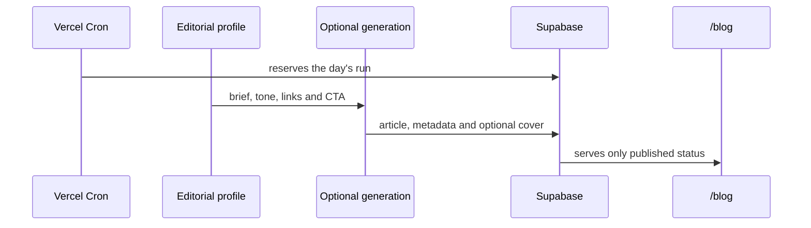

<p align="center">
  
</p>

<h1 align="center">My_Blog_Makes_Neil_Proud</h1>

<p align="center">
  Open-source infrastructure that turns an editorial brief into a published article on your domain.
</p>

<p align="center">
  <a href="https://github.com/luisroquette/My_Blog_Makes_Neil_Proud/actions/workflows/ci.yml"></a>
  <a href="https://luisroquette.github.io/My_Blog_Makes_Neil_Proud/"></a>
  <a href="https://github.com/luisroquette/My_Blog_Makes_Neil_Proud/releases/latest"></a>
  <a href="./LICENSE"></a>
  <a href="https://nextjs.org/"></a>
  <a href="https://supabase.com/"></a>
</p>

<p align="center">
  <a href="#clean-install">Start</a>
  · <a href="#how-an-article-moves">How it works</a>
  · <a href="#whats-in-the-repository">Architecture</a>
  · <a href="./SETUP.md">Full setup</a>
  · <a href="./SECURITY.md">Security</a>
</p>

---

A blog demands more than a text editor. There is the brief, the company
context, internal links, the database, SEO, publication, and a routine that
must not fire twice on the same day.

My_Blog_Makes_Neil_Proud gathers all of that into a repository you control.
The company appears under a single profile; the pipeline runs on your Next.js
and writes to your Supabase. The AI accounts, Search Console, and Vercel stay
yours.

## NEW — v1.0.0

What shipped in the first stable version (2026-08-19):

- **Full conversion** — leads with CRM plugs (Trello), moderated comments,
  A/B CTA with per-variant measurement, guest posts with byline and backlink.
- **Editorial operations** — calendar in the database (a planned brief wins
  over the seed), post-publish distribution plugs (Telegram, email digest,
  social webhook), weekly broken-link audit, `/setup` wizard.
- **Content SEO** — automatic interlinking, rich JSON-LD
  (BlogPosting + FAQPage + BreadcrumbList), categories, `page_title`,
  optimized webp cover, 2-stage pipeline with a validated outline.
- **Quality** — post-generation validator with 23 rules (Yoast-style),
  expanded persona and prompt, 119 regression tests with a pre-push hook.
- **Reading and visual** — justified text, lighter H2 color, text flowcharts,
  a CTA after every image, optional infographic.
- **Metrics** — first-party views/engagement (`blog_metrics` table) + optional
  GA4.
- **Security** — honeypots, payload sanitization, anti-tabnabbing, bot filter
  on metrics.

Full version-by-version history: [CHANGELOG.md](./CHANGELOG.md).

## Contents

- [How an article moves](#how-an-article-moves)
- [Pipeline demo](#pipeline-demo)
- [What you control](#what-you-control)
- [Clean install](#clean-install)
- [What's in the repository](#whats-in-the-repository)
- [Integrations and costs](#integrations-and-costs)
- [Operational security](#operational-security)
- [Where it fits](#where-it-fits)
- [Honest limits](#honest-limits)
- [Contributing](#contributing)

## How an article moves

<p align="center">
  
</p>



The cron only moves forward after reserving the day's run. That prevents two
publications when a manual call and the schedule arrive together. A stuck run
can be recovered. Public access reads published content only.

### Pipeline demo

<p align="center">
  
</p>

<p align="center"><sub>Conceptual flow based on this repository's real components.</sub></p>

## What you control

Everything that needs the company's look is concentrated in
[`src/lib/autoblog-profile.ts`](./src/lib/autoblog-profile.ts):

```ts
export const AUTOBLOG_PROFILE = {
  brand: { name: 'Your Company', siteUrl: 'https://yourdomain.com' },
  editorial: {
    audience: 'who you want to reach',
    tone: 'how the company speaks',
    seedKeywords: ['topic 1', 'topic 2'],
    internalLinks: [],
  },
  cta: { buttonLabel: 'Talk to the team', url: 'https://...' },
  integrations: {
    googleSearchConsoleEnabled: false,
    imageGenerationEnabled: false,
    leadCapture: { enabled: false, destination: 'trello' },
    distribution: { enabled: false, channels: [] },
  },
};
```

| You define | The template executes |
| --- | --- |
| Brand, domain, narrative and CTA | Listing page, article and SEO metadata |
| Keywords, briefs and internal links | Brief selection and editorial prompt |
| Leads and distribution | CRM plugs (Trello) and channel plugs (Telegram, email digest, social webhook) |
| Cron frequency | Run idempotency control |
| Providers and limits | Supabase persistence and publication to `/blog` |

### Generated content quality

The default prompt ([`deepseek.ts`](./src/lib/blog/deepseek.ts)) already
applies an on-page SEO checklist to every article:

- Keyword in the first words of the title, in the URL, and in the first sentence
- Title with a concrete promise, not a generic label
- Real header hierarchy (H2 per topic block, H3/H4 for subdivisions)
- At least one real, relevant external link — never an invented URL
- Minimum E-E-A-T signals and banned AI vocabulary
- Visual simplification: bullets, lists and text flowcharts ("→" arrows or flow tables)
- One CTA right after each in-body image

## Clean install

```bash
# 1. Fork and clone your copy
git clone https://github.com/YOUR-USER/My_Blog_Makes_Neil_Proud.git
cd My_Blog_Makes_Neil_Proud

# 2. Install exactly the lockfile dependencies
npm ci
cp .env.example .env.local

# 3. Confirm the base is healthy
npm run lint
npm run build
npm run audit:runtime
```

A complete installation also requires a Supabase project and a deploy. The
safe order is:

1. Edit the [editorial profile](./src/lib/autoblog-profile.ts).
2. Create your own Supabase project and apply the
   [migration](./supabase/migrations/001_autoblog.sql).
3. Fill `.env.local` with credentials created for this installation.
4. Make the first deploy without GSC or image generation.
5. Validate public reads, the authenticated cron and the database.
6. Enable text, image or GSC only once the credentials and budget are defined.

The [setup guide](./SETUP.md) details the variables, Supabase, Vercel and the
manual cron test.

## What's in the repository

| Area | File | What it does |
| --- | --- | --- |
| Company profile | [`autoblog-profile.ts`](./src/lib/autoblog-profile.ts) | Centralizes brand, editorial, CTA and activation keys |
| Pipeline | [`/api/blog/generate`](./src/app/api/blog/generate/route.ts) | Authenticates, reserves the run and orchestrates publication |
| Database and rules | [`migrations/`](./supabase/migrations/) | Creates tables, indexes and RLS — apply in numeric order |
| Public blog | [`src/app/blog`](./src/app/blog) | Lists articles and generates SEO pages with schema |
| Conversion | [`/api/blog/leads`](./src/app/api/blog/leads/route.ts) and comments | Leads via CRM plug; moderated comments |
| Distribution and setup | [`distribution.ts`](./src/lib/blog/distribution.ts) and [`/setup`](./src/app/setup) | Post-publish channel plugs and a connections checklist |
| Guest posts | [`/api/blog/guest-posts`](./src/app/api/blog/guest-posts/route.ts) | Publishes guest text with byline and backlink (the only safe backlink path) |
| Automation | [`vercel.json`](./vercel.json) | Schedules publication on weekdays and the weekly link audit |
| Quality | [CI](./.github/workflows/ci.yml) | Installs, lints and builds on every push and PR |

## Integrations and costs

Cloning the repository triggers no provider. Each integration depends on a
credential created in your account and an explicit decision in the profile.

| Integration | Initial state | When to enable |
| --- | --- | --- |
| Local-keyword briefs | On | Works out of the box with the editorial profile |
| Text generation | Not configured | After reviewing the prompt and budget |
| Google Search Console | Off | Once the domain is verified and credentials are ready |
| Cover generation | Off | Once an image account and a visual policy exist |
| Lead capture (Trello) | Off | Once Trello envs and `leadCapture.enabled` exist |
| Post-publish distribution | Off | Once the channels (Telegram, digest, social webhook) have envs |
| Comments | On | Manual moderation through the `CRON_SECRET`-protected endpoint |
| First-party metrics | On | The article beacon writes to `blog_metrics` (migration 006) |
| Google Analytics (GA4) | Off | Fill `googleAnalyticsMeasurementId` in the profile |

Available variables live in [`.env.example`](./.env.example). Never copy
another project's credentials here.

## Operational security

| Protection | How it works |
| --- | --- |
| Authenticated cron | The endpoint requires `Authorization: Bearer $CRON_SECRET` |
| Sensitive keys | Service role and credentials live on the server, outside Git |
| Public reads | RLS allows only articles with `published` status |
| Internal logs | No public-read policy |
| Duplicate runs | Daily claim blocks concurrency and recovers stuck runs |
| Dependencies | CI installs, lints and builds; run `npm audit` before upgrading packages |

Read the [security policy](./SECURITY.md) before opening an issue about a
vulnerability.

## Where it fits

Works well for B2B SaaS, consultancies, technical services, agencies and local
businesses that need to explain a product before the sale.

It also works as a base for an editorial team that wants to keep publication
in their own repository instead of a closed CMS.

## Honest limits

- The template does not replace editorial review, market knowledge or
  compliance.
- Health, legal, finance, insurance, gambling and other sensitive contexts
  need their own approval rules before any automation.
- Generated content depends on the prompt, the briefs and the chosen provider.
- The operation is yours: domain, database, keys, costs and publication
  decisions stay under your control.

## Contributing

Issues and PRs that make the template more portable, secure or simpler to
adopt are welcome. See [CONTRIBUTING.md](./CONTRIBUTING.md). For security
issues, follow [SECURITY.md](./SECURITY.md) and do not publish credentials.

## License

[MIT](./LICENSE) © 2026 The maintainers.

---

<p align="center">
  <sub>Explore other applied-AI systems and reusable open-source playbooks.</sub>
</p>
